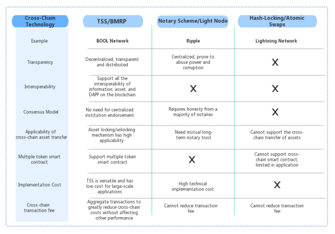
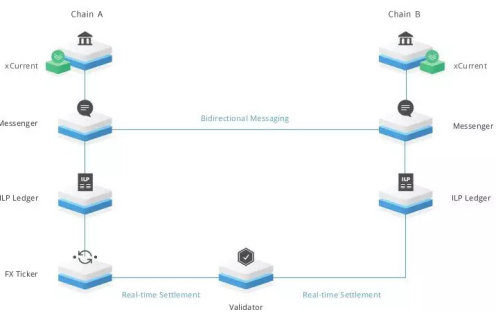
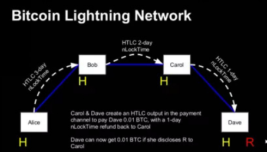
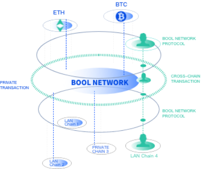
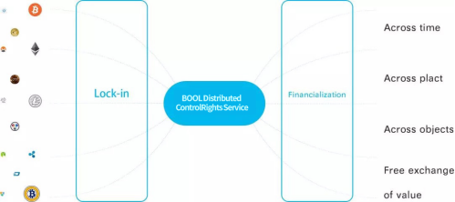

# 1. BOOL Network

## 1.1. Background of BOOL Network

With the development of web3.0, blockchain technology has entered the next stage. In order to break the barriers between various blockchains and better expand the boundaries of blockchains, cross-chain technology has attracted enormous attention and has also made great progress.

Blockchain technology and business models are still in the early stage. At present, different blockchain projects have insufficient interoperability in information and value transfer, and cannot effectively carry out business mutual trust and collaboration. Each blockchain project has become an information silo and cannot trust each other. The blockchain must leap over to the real value Internet, undertake the mission of transmitting trust, and open the era of interconnection. A universal, efficient and secure cross-chain commercial gateway is needed.

How to solve the information silo problem of the blockchain and realize the asset circulation, information exchange, application collaboration and user sharing between different blockchain platforms has become one of the most important issues in the current blockchain development. However, the blockchain cross-chain development is still at a very early stage. Although there are already many projects exploring cross-chain solutions and focusing on solving the interoperability of the blockchain, there are still plenty of room for improvement in terms of versatility and security.

## 1.2. Overview of BOOL Network

Both BOOL Network and Polkadot are designed based on the substrate framework. Although polkadot is a heterogeneous cross-chain, the cross-chain functionality is limited to the substrate development platform. For existing blockchains not developed by substrate, Polkadot introduces a transfer bridge solution to make up for it. The cross-chain architecture of BOOL Network utilize threshold signatures scheme (TSS) to implement cross-chain functionality without the need to introduce transfer bridges. BOOL Network uses a distributed private key control cross-chain solution (TSS) for multi-party computation(MPC). BOOL Network is so powerful that it could be used as a transfer bridge, an external system of Polkadot, or as the foundation for extending Polkadot's ecosystem. Furthermore, it can also run completely independent, becoming an open source public chain that can support cross-chain.

## 1.3. Design principles and characteristics of BOOL Network

BOOL Network uses the Substrate framework and zero-knowledge proof technology to achieve the secure exchange of data and value between heterogeneous blockchains. It is a set of high-performance, highly interoperable, and highly secure cross-chain underlying platforms.

The BOOL blockchain design principles are as follows:

(1) High performance.

Parallel computing and parallel storage are adopted. Through the NPOS consensus mechanism, consensus computing is performed in a multi-task parallel manner. Thereby improving the computing performance, which can be expanded to at least thousands of times per second (TPS).

(2) High versatility

Through the decoupling of the infrastructure layer, the application chain can realize the exchange of information or value with other blockchains through heterogeneous adaptation without any requirements, constraints or restrictions.

(3) High security

Highly optimized zero-knowledge proof and cross-chain communication protocol make heterogeneous cross-chain communication safe and reliable.

(4) High interoperability

One of the design goals of BOOL Network is to allow DAPP and smart contracts on the blockchain to seamlessly trade with data or assets on other chains. Based on the threshold signature scheme technology(TSS), BOOL Network has powerful cross-chain interoperability. Users only need to use the BOOL Network wallet to manage mainstream digital assets such as BTC and ETH etc.. They do not need to switch frequently in various multi-chain modules of the wallet. They can directly transfer assets such as BTC and ETH, etc. in a decentralized manner. On the BOOL Network chain, the more blockchains connected to BOOL Nework, the stronger the interoperability of BOOL Network. When all the blockchains can be linked and interoperable, it will result in more capital and better user experience. It can also enhance BOOL Network's scalability and transaction speed. One of the design goals of BOOL Network is to allow DAPPs and smart contracts on the blockchain to seamlessly trade with data or assets on other chains.
 
## 1.4. Design of BOOL Network

### 1.4.1. BOOL Network module

BOOL Network is based on the Substrate framework and forms its own unique heterogeneous multi-chain technology, which is mainly composed of the main chain, application chain and transfer bridge. BOOL Network was established to connect public blockchains, consortium blockchains, private blockchains, and all technologies that may appear in the web3.0 ecosystem in the future. It hopes to enable each independent blockchain network to achieve information exchange and trustless transactions through BOOL Network's transit bridge. It aims to achieve several goals that the blockchain has been striving to achieve: high performance, high security, high versatility, and high interoperability.

The main role of BOOL Network platform consists of main chain, application chain, and cross-chain gateway. The main chain is responsible for functions such as message recording and verification. The gateway is responsible for the access of heterogeneous chains, processing and assembling external messages, and message uploading on the chain. The application chain is a blockchain registered on the main chain. It can be a consortium chain, a public chain, or even a centralized chain service. By connecting to the main chain, application blockchain can communicate with each other.

BOOL Network is also a new cross-chain protocol that allows independent blockchains to exchange information with each other. BOOL Network created the BMRP inter-chain communication protocol, which is different from the traditional Internet message transmission protocol (such as the TCP/IP protocol). BOOL Network will also verify the message sequence and the validity of the messages during message transmission between various chains.

#### 1.4.1.1. Main chain

The main chain is the most important chain of the BOOL Network, which provides a unified consensus and security guarantee for the entire network. All validators in the BOOL Network will pledge BOOL tokens on the main chain to participate in the governance of the BOOL Network. In the BOOL Network, most business-related operations will be implemented by various parallel chains, so only a small amount of transaction types such as network governance will occur on the main chain.

#### 1.4.1.2. Application Chain

Most of the computing work in the entire BOOL Network will be executed to each application chain for processing. The application chain will be responsible for the specific business scenarios. BOOL Network does not impose any restrictions on the functions of the application chain. The application chain can be used as a specific function chain to implement certain application scenario. The application chain can have its own consensus or it can be implemented without consensus module. For the application chain without consensus, it can pass the supervision to the main chain. All application chains will share the security guarantee from the main chain. Application chains can communicate with each other through BMRP (Blockchain Message Router Protocol). At the same time they will be verified by the validator assigned to it. However, the application chain may not be a blockchain. The definition of application chain in BOOL Network is: the application chain is a data structure specific to certain applications. It is globally consistent and can be verified and authenticated by the BOOL Network main chain. Some application chains may be specific Dapp chains, or they may focus on specific functions such as privacy or scalability. They could also be some experimental application chains. In short, application chains are not necessary a blockchain in nature.

#### 1.4.1.3. Transfer bridge

The transfer bridge plays an important role in the cross-chain communication of the blockchain. In Bool Network, the TSS threshold signature scheme mechanism is mainly used for the transit bridge.

Cross-Parachain Communication: Because application chains can communicate between chains through BMRP, there is no need for smart contracts to undertake bridging functions. And BBMR-based cross-chain communication will be a solution natively supported by BOOL Network.

### 1.4.2. BMRP

BMRP (Blockchain Message Router Protocol) is a general cross-chain message routing protocol designed based on cross-chain requirements. It aims to provide a unified cross-chain message transmission specification and eliminate the difficulty in mutual authentication of cross-chain messages due to barrier of different consensus algorithms, ledger structures, and encryption mechanisms.

### 1.4.3. Private Key Sharing Agreement

At present, the mainstream models in cross-chain solutions include light node and multi-signature. The multi-signature approach of custody of assets can effectively avoid the problem of centralized authority and potential evil action by the project party. Futhermore, the multi-signature scheme requires the support of the blockchain virtual machine, which requires blockchain signature algorithms and result in poor generality. The scalability of the light node approach is seriously insufficient. When multiple chains are involved, the light nodes of the corresponding chain need to be mutually implemented. Therefore, we introduce a threshold signature protocol to remedy the above shortcomings.

## 1.5. BOOL Network's cross-chain technology solutions

The preliminary concept of the cross-chain technology is, in essence, driven by the need for complementary and interoperable value of different blockchains due to the mature of a large number of blockchains. The relationship between supply and demand is always the basis of economic and technological development. Therefore, nowadays, public chains have sprung up one after another, and the types and quantities of assets on the blockchain have also been greatly increased. If they cannot be interchanged, each ecology is a closed loop and each ecology is similar to a small country, which is very detrimental to overall integration and globalization. Therefore, the meaning and value of cross-chain functionality arises.

BOOL Network’s cross-chain technology has fulfilled the data and value interoperability of BTC, ETH, Filecoin and other heterogeneous blockchains. It solved the problem of “value information silo” in the mainstream blockchains. With the accelerated growth of BOOL Network’s cross-chain DeFi ecosystem, all digital currency users will get a better DeFi product experience and it will be easier for developers to gain economic benefits due to the continuous growth of the ecosystem.

Cross-chain interoperability can be divided into homogeneous cross-chain and heterogeneous cross-chain according to the different underlying technology platforms of the blockchains. The security mechanism, consensus algorithm, network topology, block generation verification logic between homogeneous chains are all Consistent. Therefore, the cross-chain interoperability between them is relatively simple. The cross-chain interoperability of heterogeneous chains is relatively more complicated. For example, Bitcoin uses the PoW algorithm and the consortium chain Fabric uses the traditional deterministic consensus algorithm. The block composition and certainty guarantee mechanism are very different, and the direct cross-chain interoperability mechanism is not easy to design among heterogeneous chains.

Cross-chain interoperability between heterogeneous chains generally require third-party auxiliary services to assist cross-chain interoperability. There are three mainstream cross-chain technologies: notary mechanism, side chain/relay chain, and hash lock. Early cross-chain technology focused on asset transfer, now more attention is paid to cross-chain infrastructure. Cross-chain approach has evolved from centralization to decentralization. However, the problem is decentralized design is incompatibility with historical centralized architecture. In order to take into account the interoperability between heterogeneous chains, distributed private key control is a compromise solution. It has the ability to send the cross-chain messages and has good scalability. As an encryption protocol for distributed key generation and signature, TSS allows flexible definition of threshold policies. For example, three users jointly manage a private key. Everyone only holds part of the private key. In order to sign a transaction, it is required to integrate the signature data of at least two users to construct a valid signature. TSS technology allows us to replace all private key-related commands with distributed computing. BOOL Network's distributed private key control has the following characteristics.

Generation: If the private key is controlled by a single entity during the generation process, then the private key fragmentation storage does not make sense, so BOOL Network generates the private key in a distributed manner.

Storage: If the private key is stored in one place, it is subject to malicious node attack. Therefore, in order to ensure the security of the private key, BOOL Network heterogeneous splits the private key and stores it on different nodes.

Privacy: Display the effective address associated with the private key on the BOOL Network, and reduce the exposure of additional information, effectively avoiding hacking by malicious nodes.

Availability: Because the private key fragments are distributed on different nodes, when the node is offline due to force majeure, heterogeneity can also guarantee the overall availability of the private key.

Through the BOOL Network cross-chain, the blockchains interconnection is realized. Bool Network solves some problems that cannot be solved by many other public chain projects, such as:

1. Proof of the authenticity of message M, that is, whether M does exist on chain A, and it is indeed sent from chain A to chain B;

2. The routing of message M, how to securely route cross-chain messages across systems;

3. The validity proof of message M. The validity here refers to how the message M from chain A allows chain B to recognize that the state is still valid when it arrives on chain B, such as whether the transferred assets are frozen and there is no double spend or whether the status has changed during this period, etc.;

4. The execution result of message M proof. This means that the A chain needs to confirm whether the cross-chain operation is successful and the corresponding receipt of the successful operation.

## 1.6. The difference between the threshold signature scheme and other mainstream cross-chain schemes

### 1.6.1. Polkadot's cross-chain mechanism

Polkadot uses a relay chain + parachain + transit bridge architecture to achieve heterogeneous cross-chain. Between the parallel chains of the Polkadot network, they communicate with each other through ICMP. ICMP means Inter-Chain Message Passing, that is inter-chain message passing. ICMP is a protocol in the Polkadot network, which defines a way of messaging without additional trust between parachains and/or relay chains. It relies heavily on the existence of the relay chain in the Polkadot network. Without the relay chain ICMP, it would be meaningless. As far as the consensus mechanism in the Polkadot network is concerned, the ICMP protocol does not include the lower-level network and the message semantics itself. It is totally dependent on Polkadot's proprietary technical stack. The cross-chain advantage of BOOL Network distributed private key management is that it has higher compatibility and scalability and can easily access blockchain systems of different consensus schemes and different encryption schemes.

### 1.6.2. Notary Public Mechanism

The notary mechanism is not an open ledger, nor does it need to seek any form of consensus. It is more like a trust connector that provides a top-level encrypted custody system. Under the trust guarantee of the notary node, the funds can be in each blockchain. The ledgers flow between different ledgers systems for free digital asset transactions through notaries. The notary mechanism is a two-way cross-chain, which can facilitate the exchange and transfer of cross-chain assets. It is relatively easy to operate using smart contracts between chains, but it is extremely prone to centralization problems. This solution is obviously different from the blockchain. In  contrast, BOOL Network's distributed private key management has higher transparency and is based on decentralized design thinking. It completely abandon the credit endorsement mechanism of centralized institutions.

### 1.6.3. Hash-locking

Hash lock is a cross-chain solution without the intervention of a third party. It is completely de-intermediary. Assets can be exchanged on different chains through it. However, it cannot realize the transfer of cross-chain assets, let alone cross-chain smart contracts. It is currently mainly used in Bitcoin Lightning Network. Lightning Network does not try to solve the problem of single payment. It is based on the assumption that the amount of single payment is small enough. Even if one party defaults, the other party's loss is very small and the risk can be tolerated. Therefore, it is very limited.

### 1.6.4. BOOL Network's distributed private key solution

BOOL Network achieves the connection and value exchange of different blockchain ledgers in a distributed manner. It adopts a general cross-chain protocol and a distributed ledger that records cross-chain transactions and intra-chain transactions. The public chain, private chain or consortium chain can be connected to the BOOL Network to connect heterogeneous blockchain ledgers and make cross-ledgers of assets Transfer.

Various digital assets can be mapped to the BOOL Network chain through distributed private key generation and control technology. A variety of mapped digital assets can be freely interoperated on BOOL Network. The operations to realize and release distributed control rights management are called: Lock-in and Lock-out. Lock-in is the process of making distributed control right management and asset mapping for all digital assets controlled by keys. Unlocking is the reverse operation of lock-in, returning the control of digital assets to the owner. This multi-signature method of custody of assets can effectively avoid the problem of over-concentration of permissions. Furthermore, it has better applicability and is not limited to on-chain smart contract. At the same time, the threshold signature scheme aggregates the transaction volume which reduces the gas fee and does not impose any burden on the chain.

As various assets are mapped to the BOOL Network, the attributes on the original chain are lost and its main attribute is financial value. So what BOOL Network will do is decentralized finance in the era of value internet namely DeFi.

## 1.7. BOOL Network cross-chain technology is DeFi native 

The origin of DeFi and the digital currency native community were the first concepts proposed by cofounder and CEO of DHarma Labs. The essence of DeFi is to allow users to provide financial services based on blockchain technology without resorting to the traditional middle institutions (banks, fund managers, etc.). It can perform transactions and other operations on their own. Thus it creates a completely different and independent system from traditional financial systems. The history of development of DeFi is actually very short. The birth of MarkerDAO is only three years old. This application is aimed at the stable currency market of digital currencies. It supports users to generate stable currency Dai against the US dollar in the form of excess pledge. By July 2018, the amount of digital assets locked on MakerDAO exceeded $150 million and the success of MakerDAO inspired the blockchain community. After that, DeFi applications are springing up.

In 2018, the well-known DeFi applications Compound, DYDX, Uniswap, Dharma, and Augur were launched. Synthetix, DDEX, dForce, Veil, Kyber were launched in 2019.

In 2020, Loopring, Curve, Balancer, and Aave were launched one after another and occupied the top positions in the DeFi applications in a short period of time. In the same year, "yield farming" set off a lock-up frenzy in the DeFi field.

As of September 2020, DeFi's entire network lock-up mortgage amount has exceeded 10 billion US dollars.

With the continuous development blockchain technology of decentralized finance (DeFi) as the core technology, more and more developers and users have joined the DeFi ecosystem. At the same time, there is a great opportunity in DeFi with the rapid growth of locked-up funds and technological advancement in the DEFI field.

But at the same time there is a serious problem. Almost all the projects in the above examples are based on ETH. This makes the already bloated ETH even worse, while other blockchains with better performance have a larger waste of resource. The problem of inability to connect has seriously affected the development of DeFi. It is an urgent problem to connect blockchains into a complete network through cross-chain as a bridge to achieve interconnection. The BOOL Network cross-chain will solve the current development of DeFi problems especially large-scale application problems. As the most important application of blockchain, Defi will also enjoy the development opportunities brought by cross-chain.

First of all, BOOL Network's heterogeneous cross-chain can connect the link between each blockchain. All users on separate chains will be connected and the Defi application can realize the free circulation and swapping between all users to facilitate tremendous growth in scale.

Secondly, the assets on the cross-chain to the BOOL Network chain can be freely circulated and traded. There is no need to go through a centralized exchange for conversion. Abundant circulation of assets can create the richer user case scenarios and new models of Defi, which is conducive to the popularization and activation of Defi. 

Third, BOOL Network cross-chain can achieve contract-level interaction. It can achieve interoperability in any ecosystem to promote greater value circulation of Defi and make the transfer and circulation of assets easier and more convenient.

BOOL Network cross-chain technology will play a vital role in expanding the DeFi ecosystem, improving asset liquidity, and solving the problem of limited functionality and performance of a single blockchain system. It can create smart contract-based mortgages and mutual recognition between more assets and lay the broader ecological development foundation for Defi.

## 1.8. Problems solved by BOOL Network in the DeFi field

The problem BOOL Network is trying to solve is to break the current problem of inability to communicate and interoperate between blockchains. In our current blockchain industry, each blockchain runs on its own, just like islands. Each blockchain has its own ecology, but they cannot communicate with each other. For example, when users use Ethereum's DeFi application, they cannot communicate with the DeFi of other chains. Each blockchain is a closed system and the blockchain cannot truly become a decentralized network.

BOOL Network's cross-chain technology is highly targeted to solve the current development bottleneck of Defi. The breakthrough of cross-chain technology can not only solve the large-scale development and application of Defi, but also solve the problem of data isolation that affects the adoption of large-scale applications. After the BOOL Network is officially launched, each heterogeneous blockchain is added to the main chain as an application chain and communicates through the BMRP cross-chain protocol for interoperability. Therefore, it will break the “information silo” making the blockchain truly decentralized and constructing the Internet of the blockchain.

In short, heterogeneous cross-chain is one of the most important problems solved by Bool Network.

## 1.9. BOOL Network's cross-chain DeFi will have a profound impact on the current Ethereum DeFi ecosystem

Ethereum congestion leads to high gas fees. The fundamental problem is that the performance of Ethereum is limited and each DAPP must compete for the right to execute. The heterogeneous cross-chain mechanism of BOOL Network is like a computer room. Each server is divided into areas to serve a project separately and independently. Each blockchain finds a suitable server in this computer room. It no longer need to compete for execution resources. So it can be allocated on demand and paid on demand, which naturally avoids the problems of congestion and high gas fees. Therefore, after the cross-chain maturity of BOOL Network's application chain, it can actually be comparable to the sharding technology of Ethereum 2.0. To become Ethereum2.0 is not the goal of BOOL Network. The adoption of Ethereum 2.0 may only be the starting point of BOOL Network.

BOOL Network is now the most friendly infrastructure layer for DeFi projects on Ethereum. The team has developed the first Ethereum bridge based on BOOL Network. For DeFi on Ethereum, it can be implemented directly on BOOL Network. The interoperability between ether and other chains are implemented. BOOL Network has been proven to be able to achieve cross-chain interoperability and cross-chain transactions. We are ready to integrate the assets of Ethereum and the contract on Ethereum to solve the problem of unpredictable delay of launch of Ethereum 2.0. BOOL Network not only solves the problem of congestion, but also each application chain of BOOL Network solves the public chain problem of lack of support for specific industry and professional application requirements. Therefore, in the application chain ecology of BOOL Network, there will be a special DeFi chain in the future as well as a special identity chain, a special Ethereum bridge chain, a special Bitcoin bridge chain and some other industry application specific chains. Together, these application chains can provide a very rich variety of functions for the migrated Ethereum DeFi. Just like we use the Internet now, it is very convenient to integrate identity, and privacy applications such as games and entertainment through the BOOL Network application chain. All of this is because of the cross-chain mechanism of BOOL Network, which naturally attracts various public chains and consortium chains to build a cross-chain ecology.

## 1.10. BOOL Network complements the consortium chain and empowers the development of industrial blockchain

The continuous development and maturity of blockchain technology has set a technical foundation for the consortium chain. Various institutions including banks, insurance, financial management, trust, industrial supply chains, etc. have established their own consortium chains. However, these platforms are unique and each has been applied in different fields. These applications based on homogeneous platforms or based on heterogeneous platforms will face some technical challenges to achieve interconnection and interoperability. They cannot exchange information with each other. Assets on various consortium chains can only be circulated on their own chains. This is completely unfavorable to data and value circulation between various structures, and constitutes a "value information silo". Blockchain, as a machine for building and transmitting trust, is a technology at the infrastructure level. Like network protocols and storage protocols, it will eventually move towards a standardized direction. Therefore, the current state of the consortium chain is a transitional state in development, not a final stable state. BOOL Network can play a role as a bridge in all consortium chains, whether homogeneous or heterogeneous. A new standard is established through cross-chain protocols to help assets on various consortium chains to circulate on a larger scale, such as the automobile industry. In the supply chain finance field, the assets on the chain can only reach a consensus within the consortium chain. If it goes out of the scope of the industrial alliance, it becomes worthless. To solve this problem, BOOL Network uses its powerful cross-chain mechanism to integrate the assets on the consortium chain. Assets are mapped to BOOL Network. Because everyone follows the same consensus mechanism, users do not need to re-establish trust and make cross-chain assets credible. This greatly increases the circulation range of assets on the consortium chain, generates a liquidity premium and helps companies seek financing quickly.

## 1.11. BOOL Network brings a new ecology to Filecoin

BOOL Network is the first cross-chain to support Filecoin. BOOL Network has the first mover advantage. Since 2019, BOOL Network is paying close attention to the development of Filecoin distributed storage. In the cross-chain, users bind the mining address through the BOOL Network wallet, and the generated tokens can choose to be sold directly in the wallet and exchanged for stable coins. On the other hand, the community can develop a Filecoin-based mortgage loan to solve the pre-mining in the Filecoin system. With the economic model of mortgage, miners can borrow tokens from BOOL Network as pre-mortgage with the help of BOOL Network wallet. Miners only need to pay no more than 10% interest, which can greatly reduce the pledge cost by at least 90%. If Filecoin can officially support it with this kind of external mortgage, BOOL Network's blockchain ecology is bound to gain the attention of the Filecoin community.

## 1.12. What are the advantages of DEX based on BOOL Network ecosystem compared with traditional DEX?

After June of this year, although DEX exchanges have begun to explode especially DEX on ETH, various innovative gameplays have emerged one after another igniting the passion of the market. However, the high gas fee makes it difficult for many users to adopt. While non-ERC20 owners also find it difficult to enjoy the Defi boom on Ethereum. If this is a cross-chain DEX, the situation is completely different. Users can use their own assets, whether it is BTC or ETH, they can participate in DeFi (including providing BTC Liquidity). All other chains can share the depth of BOOL Network’s cross-chain DEX. The advantage of this cross-chain DEX is that once it is formed, a certain scale effect will become a new Dex paradigm and produce a siphon effect. With the continuous growth of consensus, it will completely replace the existing single-chain DEX. There is currently no product that can provide a BTC circulation pool. If BOOL Network develops the community, it could be a game changer.

## 1.13. Future plan of BOOL Network

Community building is still a competitive field of various players in the blockchain field. The underlying protocol of Bool Network is destined to be satisfied with DeFi for cross-chain assets, creating a new DeFi cross-chain paradigm. Based on the underlying cross-chain modules and modules provided by Bool Network, application middleware provides the most secure, efficient and low-cost cross-chain DeFI development experience for Bool ecological participants.

At present, the "Bool Network Community Development Plan" has been officially launched:

We will gradually open source the infrastructure layer and development kits of BOOL Network, and hold the BOOL Network Developer Community Application Competition. We will select the most ecologically valuable applications and award them. We encourage BOOL Network community developers will migrate mainstream Dex, such as Uniswap, Balancer, and mainstream liquidity mining pools to the BOOL Network wallet ecosystem, creating a cross-chain Dex for BOOL Network with a wider range coverage of users. At the same time, BOOL Network was invited by Wanxiang to actively participate in the web3 summit. It is hosted by the group in China with many blockchain institutions to jointly build a new Internet digital economy of Web3.0 world based on blockchain of transparency and trust.

Looking back at the ten-year history of blockchain development, so far, the cross-chain interoperability of blockchain has never played an important role. Our blockchain world has evolved into an isolated place. The market value of Bitcoin is 200 billion U.S. dollars and Ethereum is 40 billion U.S. dollars. However, both of them are isolated with each other. How can we break these isolated walls? Therefore, BOOL Network’s cross-chain functionality has the great potential to solve the above problem.  The strong interoperability of BOOL Network will inevitably be the new star to link to WEB3 after 2020.
